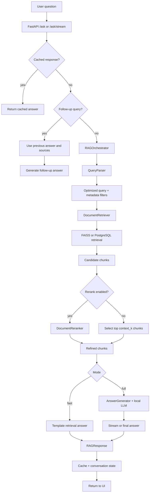
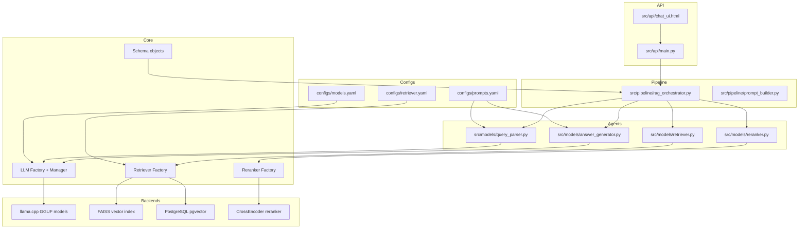
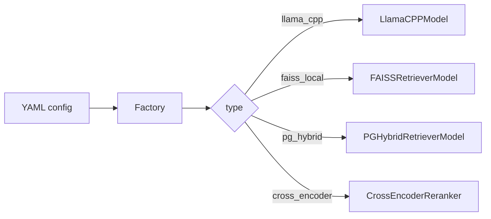
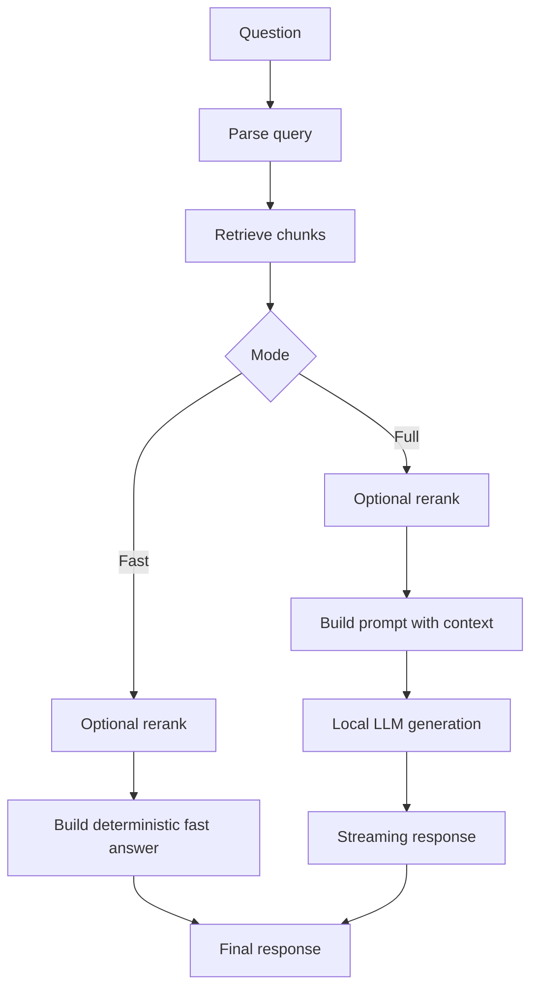
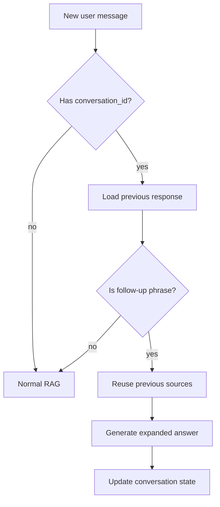

# Báo Cáo Ý Tưởng Lõi Dự Án NLP Assignment

Ngày cập nhật: 2026-06-15

## 1. Tổng Quan

Dự án NLP Assignment là một chatbot Retrieval-Augmented Generation (RAG) hỗ trợ hỏi đáp về các hàm trong thư viện Python. Người dùng đặt câu hỏi tự nhiên, hệ thống truy xuất tài liệu hàm liên quan, sau đó trả lời bằng lời giải thích ngắn gọn kèm ví dụ code khi phù hợp.

Mục tiêu chính của project là xây dựng một pipeline hỏi đáp kỹ thuật có thể cấu hình được, chạy local, phản hồi nhanh và đủ linh hoạt để thay đổi model, retriever, reranker, prompt mà không cần sửa sâu trong code.

Các thành phần chính:

- FastAPI backend nhận câu hỏi và trả về response/stream.
- Chat UI đơn giản cho người dùng cuối.
- Query parser để tối ưu câu hỏi và trích xuất filter.
- Retriever để tìm tài liệu liên quan từ FAISS hoặc PostgreSQL hybrid search.
- Reranker tùy chọn để sắp xếp lại candidate chunks.
- Answer generator dùng local GGUF model qua llama.cpp.
- YAML configs để đổi model, retrieval settings và prompt.
- Cache và conversation memory cho câu hỏi lặp lại hoặc follow-up.

## 2. Bài Toán

Bài toán của hệ thống là trả lời các câu hỏi về API/hàm Python như:

- `What is pandas.merge used for?`
- `How do I read a CSV file with pandas?`
- `How can I split data into train and test sets with sklearn?`

Nếu chỉ đưa câu hỏi trực tiếp cho LLM, model có thể trả lời sai hoặc bịa API. Vì vậy hệ thống dùng RAG:

1. Tìm tài liệu hàm liên quan từ bộ dữ liệu đã index.
2. Chỉ đưa các đoạn tài liệu phù hợp vào context.
3. Yêu cầu LLM trả lời dựa trên context đó.

Điểm cốt lõi là giảm hallucination và giúp câu trả lời bám vào tài liệu có thật.

## 3. Dữ Liệu Và Index

Pipeline dữ liệu của project gồm:

| Thành phần | Vai trò |
|---|---|
| `data/parsed/function_docs.jsonl` | Tài liệu hàm đã parse |
| `data/chunks/functions.jsonl` | Chunk dùng cho retrieval |
| `data/training/*.jsonl` | Dữ liệu train/test cho retriever |
| `models/faiss/functions.index` | FAISS vector index local |
| `models/faiss/functions_metadata.jsonl` | Metadata đi kèm vector index |
| PostgreSQL/pgvector | Backend hybrid search tùy chọn |

FAISS là backend mặc định hiện tại vì phản hồi nhanh và phù hợp demo local. PostgreSQL hybrid search vẫn được giữ như một lựa chọn khác cho semantic + keyword search.

## 4. Flow Lõi Của Hệ Thống



Ý tưởng trung tâm:

1. API nhận câu hỏi từ UI.
2. Cache xử lý câu hỏi trùng để trả lời nhanh.
3. Conversation state giúp câu hỏi như `more detail` tiếp tục đúng ngữ cảnh.
4. QueryParser chuẩn hóa câu hỏi và suy ra filter thư viện.
5. Retriever lấy candidate chunks từ FAISS/PostgreSQL.
6. Reranker có thể bật/tắt tùy nhu cầu tốc độ.
7. Fast mode trả lời bằng template nhanh.
8. Full mode dùng LLM sinh câu trả lời từ context.

## 5. Kiến Trúc Module



## 6. Các Thành Phần Chính

### 6.1 FastAPI Backend

File chính: `src/api/main.py`.

Backend cung cấp:

- `GET /`: trả về chat UI.
- `GET /health`: kiểm tra server còn sống.
- `POST /ask`: trả về response JSON hoàn chỉnh.
- `POST /ask/stream`: stream token theo NDJSON để UI thấy chữ ra dần.

Backend cũng quản lý:

- `_response_cache`: cache câu hỏi đã hỏi.
- `_conversation_state`: lưu câu trả lời gần nhất theo `conversation_id`.
- `_pipeline_lock`: tránh chạy nhiều llama.cpp model instance song song trong demo local.

### 6.2 RAGOrchestrator

File chính: `src/pipeline/rag_orchestrator.py`.

Đây là lớp điều phối luồng RAG:

```text
user_query
-> QueryParser
-> DocumentRetriever
-> optional DocumentReranker
-> AnswerGenerator hoặc Fast answer
-> RAGResponse
```

RAGOrchestrator cũng xử lý:

- Chọn có rerank hay không dựa trên mode/config.
- Giới hạn số chunk đưa vào context bằng `context_k`.
- Ưu tiên exact function match nếu query nhắc trực tiếp tên hàm như `pandas.merge`.
- Tạo source snippets để UI/API hiển thị hoặc dùng cho follow-up.

### 6.3 QueryParser

File chính: `src/models/query_parser.py`.

QueryParser có hai vai trò:

- Rewrite câu hỏi thành semantic query rõ hơn cho vector search.
- Trích xuất metadata filter như `library_name`.

Parser có rule-based fallback cho các câu phổ biến:

- Merge DataFrame bằng pandas.
- Đọc CSV bằng pandas.
- Chia train/test bằng sklearn.

Nếu rule không xử lý được, parser dùng local LLM parser theo cấu hình trong `configs/models.yaml`.

### 6.4 Retriever

File chính:

- `src/core/retriever/faiss_retriever.py`
- `src/core/retriever/pg_hybrid_retriever.py`
- `src/core/retriever/factory.py`

Retriever hiện có hai backend:

| Backend | Ý nghĩa |
|---|---|
| `faiss_local` | Vector search local, nhanh, phù hợp demo |
| `pg_hybrid` | Kết hợp pgvector semantic search và PostgreSQL full-text search |

Backend được chọn bằng `configs/retriever.yaml`, ví dụ:

```yaml
type: "faiss_local"
retrieval_k: 8
context_k: 3
fast_mode_rerank: false
full_mode_rerank: false
```

### 6.5 Reranker

File chính:

- `src/models/reranker.py`
- `src/core/reranker/cross_encoder_reranker.py`
- `src/core/reranker/factory.py`

Reranker dùng CrossEncoder để chấm điểm lại các candidate chunks. Vì reranker làm chậm response, project cho phép bật/tắt riêng:

- `fast_mode_rerank`
- `full_mode_rerank`

Thiết kế này giúp demo nhanh hơn nhưng vẫn giữ đường nâng chất lượng khi cần accuracy cao hơn.

### 6.6 AnswerGenerator

File chính: `src/models/answer_generator.py`.

AnswerGenerator:

- Format retrieved context theo `configs/prompts.yaml`.
- Detect ngôn ngữ câu hỏi để trả lời tiếng Anh hoặc tiếng Việt.
- Gọi local LLM qua llama.cpp.
- Hỗ trợ stream token.
- Hỗ trợ follow-up bằng previous question, previous answer và previous sources.
- Loại bỏ `<think>...</think>` nếu model sinh reasoning nội bộ.

## 7. Factory Pattern Và Config-Driven Design

Một điểm mới quan trọng của code là dùng factory và config ngoài.



Lợi ích:

- Đổi model bằng cách sửa `configs/models.yaml`.
- Đổi backend retrieval bằng `configs/retriever.yaml`.
- Đổi prompt bằng `configs/prompts.yaml`.
- Giảm hard-code trong Python.
- Dễ mở rộng thêm OpenAI, Elasticsearch hoặc retriever khác sau này.

## 8. Fast Mode Và Full Mode



Fast mode:

- Ưu tiên tốc độ.
- Mặc định skip reranker.
- Không gọi generator LLM.
- Trả lời dựa trên top retrieved chunk và template.

Full mode:

- Ưu tiên câu trả lời tự nhiên hơn.
- Có thể stream token.
- Dùng retrieved context để prompt LLM.
- Vẫn có thể skip reranker nếu cần demo nhanh.

## 9. Follow-Up Handling

Một vấn đề quan trọng của chatbot là câu hỏi ngắn như:

- `more detail`
- `explain more`
- `nói rõ hơn`
- `cho ví dụ nữa`

Nếu xem đây là query mới, retriever có thể tìm sai topic. Project xử lý bằng cách:

1. Lưu response trước đó theo `conversation_id`.
2. Nhận diện follow-up query bằng rule.
3. Không chạy retrieval mới.
4. Gửi previous question, previous answer và previous sources vào AnswerGenerator.
5. Sinh câu trả lời mở rộng theo đúng ngữ cảnh trước đó.

Flow:



## 10. Prompt Design

Prompt được tách ra file `configs/prompts.yaml`.

Parser prompt yêu cầu model trả JSON:

- `optimized_query`
- `filters.library_name`

Generator prompt yêu cầu:

- Chỉ dùng retrieved documentation.
- Trả lời theo ngôn ngữ người dùng.
- Nêu API/hàm phù hợp trước.
- Có ví dụ code ngắn khi hữu ích.
- Không bịa tham số hoặc hành vi không có trong context.

Thiết kế này giúp chỉnh hành vi chatbot mà không cần sửa code.

## 11. Điểm Mạnh Của Project

- Có kiến trúc rõ: API, pipeline, agents, core backend, configs.
- Có factory pattern để đổi model/retriever/reranker dễ hơn.
- Có FAISS local retrieval cho tốc độ demo tốt.
- Có Full mode streaming để cảm giác phản hồi nhanh hơn.
- Có cache cho câu hỏi lặp lại.
- Có follow-up memory cho các câu mở rộng như `more detail`.
- Prompt được đưa ra ngoài YAML nên dễ chỉnh.
- UI tập trung vào chat, phù hợp mục tiêu người dùng cuối.

## 12. Hạn Chế Hiện Tại

- Chất lượng trả lời phụ thuộc nhiều vào chất lượng FAISS index và chunk metadata.
- Fast mode có một số template thủ công cho các hàm phổ biến.
- Full mode vẫn có độ trễ do local GGUF model.
- Follow-up detection đang dựa trên rule, chưa phải intent classifier đầy đủ.
- Reranker mặc định tắt để nhanh, nên một số query khó có thể kém chính xác hơn.
- Cache hiện là in-memory, restart server sẽ mất cache.

## 13. Hướng Cải Thiện

Các hướng cải thiện hợp lý:

1. Bổ sung benchmark tự động cho câu hỏi mẫu và expected function.
2. Dùng semantic intent classifier cho follow-up thay vì rule đơn giản.
3. Lưu cache ra SQLite hoặc Redis nếu muốn demo dài.
4. Thêm citation/source view gọn trong UI nếu cần kiểm chứng.
5. Tune `retrieval_k`, `context_k`, reranker và prompt theo từng nhóm thư viện.
6. Chuẩn hóa lại encoding tiếng Việt trong README/config nếu còn mojibake.
7. Thêm backend LLM khác qua factory nếu cần đổi khỏi llama.cpp.

## 14. Tóm Tắt Một Câu

Dự án NLP Assignment là một chatbot RAG cho tài liệu hàm Python, trong đó câu hỏi được parse, truy xuất tài liệu bằng FAISS/PostgreSQL, tùy chọn rerank, rồi trả lời bằng fast template hoặc local LLM dựa trên context, với cache và follow-up memory để tăng tốc và giữ đúng ngữ cảnh hội thoại.
